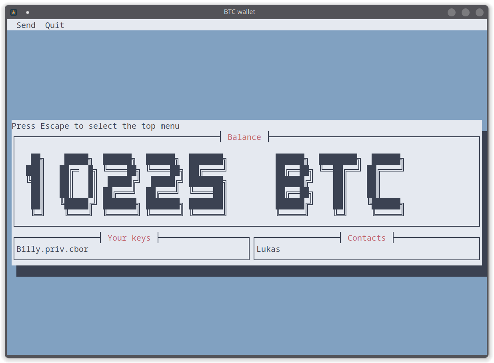

# Bitcoin Project

🚀 A hands-on exploration of blockchain technology through a Rust implementation of a Bitcoin-like system. This portfolio project demonstrates practical understanding of cryptocurrency concepts, distributed systems, and Rust programming.

## What Makes This Project Cool?

This project is organized as a Rust workspace that brings together all the exciting pieces of a cryptocurrency system:

- `lib`: The backbone of our blockchain - where all the cryptographic magic happens
- `miner`: Experience the thrill of mining blocks and securing the network
- `node`: Be part of a decentralized network with peer-to-peer communication
- `wallet`: Create transactions and manage digital assets

## Technical Highlights

🔗 **Blockchain Implementation**
- Basic blockchain structure with blocks and transactions
- UTXO (Unspent Transaction Output) tracking
- Simple proof-of-work mining
- Mempool for pending transactions

⛏️ **Mining System**
- Basic proof-of-work mining
- Dynamic difficulty adjustment
- Block rewards

🌐 **Network Layer**
- TCP-based peer-to-peer communication
- Transaction and block propagation

💼 **Wallet Features**
- Balance checking
- Transaction creation
- Simple TUI interface using cursive

## Getting Started

1. Make sure you have Rust installed:
```bash
curl --proto '=https' --tlsv1.2 -sSf https://sh.rustup.rs | sh
```

2. Build the project:
```bash
cargo build --release
```

## Running the Components

Start your own mini cryptocurrency network:

```bash
# Generate your key pair first
cargo run --bin keygen <name>    # This will create <name>.pub.pem and <name>.priv.cbor

# Run a network node
cargo run --bin node [<nodes...>] --port <port> --blockchain-file <blockchain-file>
# Options:
#   nodes             - addresses of initial nodes
#   --port            - port number
#   --blockchain-file - blockchain file location

# Fire up a miner
cargo run --bin miner --address <ADDRESS> --public-key-file <PUBLIC_KEY_FILE>
# Required options:
#   -a, --address         - Your miner's address
#   -p, --public-key-file - Path to your public key file

# Create a wallet and make transactions
cargo run --bin wallet [OPTIONS] [COMMAND]
# Options:
#   -c, --config <FILE>   - Config file [default: wallet_config.toml]
#   -n, --node <ADDRESS>  - Node address to connect to
# Commands:
#   generate-config     - Generate a new wallet configuration
```

## Interactive Wallet TUI

The wallet comes with an interactive Terminal User Interface (TUI) that makes it easy to:
- View your balance
- View your contacts - as per the wallet configuration
- Send transactions



## Development Notes

This project helped me learn:
- Basic blockchain concepts
- Working with async Rust and Tokio
- Binary serialization with CBOR
- Building terminal UIs with cursive
